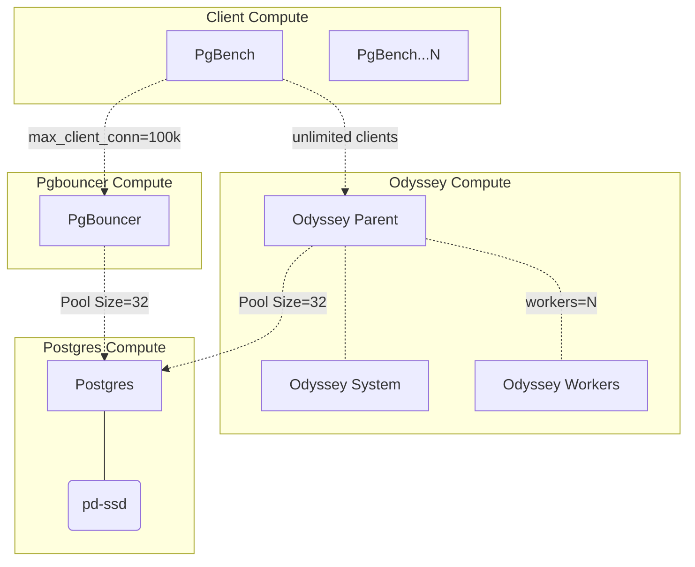

# Exhausting Pools

Odyssey and PgBouncer Pool Stress scenario.


## Context

This laboratory is a hypothetical scenario, whether application does empty transactions
in order to emulate sort of a DoS attack against the pools. The intention here, was to 
study the behavior of 2 very popuplar Postgres Pools in these cases.

The main difference between both pools relies on how they use CPU resources. PgBouncer
is a single-threaded services, whether Odyssey uses threaded workers. It is expected certain
overhead on multi-thread in these cases, and that was the moto of this laboratory.

## Early Conclusions

See [Docs](/doc/) for collected stats.

PgBouncer is more perfomant at single-thread, no surprise. However, the stability of Odyssey
may be relevant. PgBouncer stalls during a certain period, mostly because its mechanism to 
put connections in wait state meanwhile the core is fully allocated. Odyssey can be less
performant, but it didn't stall badly.

Of course, in a production environment, it would be suicidal to go with a single pool, and 
that's where there are better techniques for deploying PgBouncer.

It may probably be more recommedable to go with Odyssey (or other multi-threaded solution) when
spawning pools on dedicted hardware or resources, as it is straightforward to do so. PgBouncer
supports multi-process in the same machine through [so_reuseport](https://www.pgbouncer.org/config.html#so_reuseport)],
but it ties each process to a core, which makes the configuration and core assignment a little
bit more hackish.

However, in automated architectures such as Kubernetes (whether you an assign services programmatically),
PgBouncer might be more convenient, as it is more performant whenever it keeps connections out of
waiting state.


## Architecture

In order to save infrastructure resources, benchs can run to pgbouncer and
odyssey but not at the same time. Both pools point to the same database endpoint and
client can point indistintively to each of the pools.




## Setup

### Install requirements

```
https://github.com/adammck/terraform-inventory
gcloud
terraform
```


> Note: If you don't have setup a Postgres backend for Terraform, do it first and change
> the connection string accordingly.

Create an `.env` file with the following configuration:


```bash
export PROJECT=<project>
export BACKEND_CONNSTR="conn_str=postgres://user:pass@<URI>/poc_odyssey_tfstate"
```

Before executing anything, authenticate through `gcloud` -- create an Editor privileged Service Account:

```
gcloud auth login
gcloud auth activate-service-account --key-file=$HOME/.gcloud/postgresql-support-dev-terraform-admin.json
gcloud auth application-default login
```

## init

```bash
make ENV=testing init
```

Then, as usual:

```bash
make ENV=testing plan|apply
```

## Bench tests

From any client (points to database endpoint):

```
/usr/local/bin/plainbench.sh -i
```


```
/usr/local/bin/plainbench.sh [odyssey|pgbouncer] [secs] [conn] [iter]
```

eg:

```
/usr/local/bin/plainbench.sh odyssey 20 500 20
```
