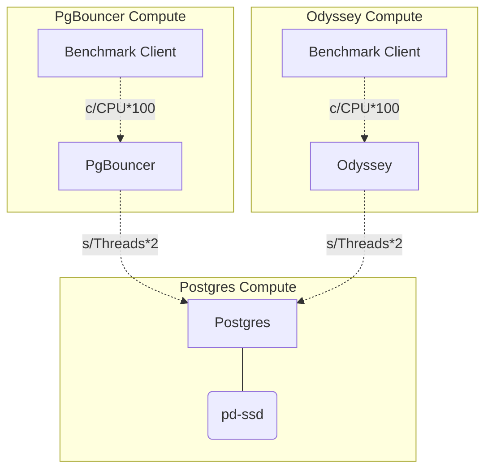

# poc-odyssey

Odyssey and PgBouncer comparison. 




## Setup

### Install

```
https://github.com/adammck/terraform-inventory
gcloud
terraform
```


> Note: If you don't have setup a Postgres backend for Terraform, do it first and change
> the connection string accordingly.

> OnGres members Note: there is an existent backend database created for this project.
> Contact: emanuel at ongres.com

Create an `.env` file with the following configuration:


```bash
export PROJECT=<project>
export BACKEND_CONNSTR="conn_str=postgres://user:pass@<URI>/poc_odyssey_tfstate"
```

Before executing anything, authenticate through `gcloud` -- create an Editor privileged Service Account:

```
gcloud auth login
gcloud auth activate-service-account --key-file=$HOME/.gcloud/postgresql-support-dev-terraform-admin.json
gcloud auth application-default login
```

## init

```bash
make ENV=testing init
```

Then, as usual:

```bash
make ENV=testing plan|apply
```

